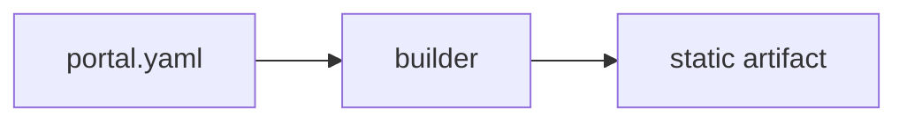

## Text and links

Ordinary emphasis, **strong text**, `inline code`, ~~strikethrough~~ and an
[internal link](../reference.rst) that resolves to another page's route.

An external link goes to <https://www.example.org/>, and a bare www autolink such
as www.example.org is normalised to HTTPS before it is validated.

## Admonitions

:::warning[Read this first]
Only `note`, `tip`, `warning` and `caution` are accepted. An unknown directive
name stops the build with a source location.
:::

## Code

```python
def search(project: str) -> list[str]:
    """Highlighted at build time; no highlighter ships to the browser."""
    return [project]
```

```unknownlang
This block warns about the language and renders as escaped plain text.
```

## Tables and task lists

| Facet    | Meaning               |
| -------- | --------------------- |
| project  | The archive partition |
| variable | The physical variable |

And one wider than the measure, so the scroll container is exercised on the same page:

| dataset | grid       | levels | variables | frequency | calendar            | first year | last year | licence   | contact             |
| ------- | ---------- | ------ | --------- | --------- | ------------------- | ---------- | --------- | --------- | ------------------- |
| ERA5    | HEALPix z9 | 137    | 48        | hourly    | proleptic_gregorian | 1979       | 2024      | CC-BY-4.0 | archive@example.org |
| ICON    | HEALPix z9 | 90     | 31        | 3-hourly  | proleptic_gregorian | 2020       | 2023      | CC-BY-4.0 | archive@example.org |

- [x] Task lists render as passive markers
- [ ] and never as form controls

## Mathematics

Inline $E = mc^2$ and a display equation:

$$
\int_{0}^{1} x^2 \, dx = \frac{1}{3}
$$

## Diagrams



## Images


## Footnotes

The renderer supports footnotes.[^why]

[^why]: Because GFM footnotes are in the profile's extension list.
